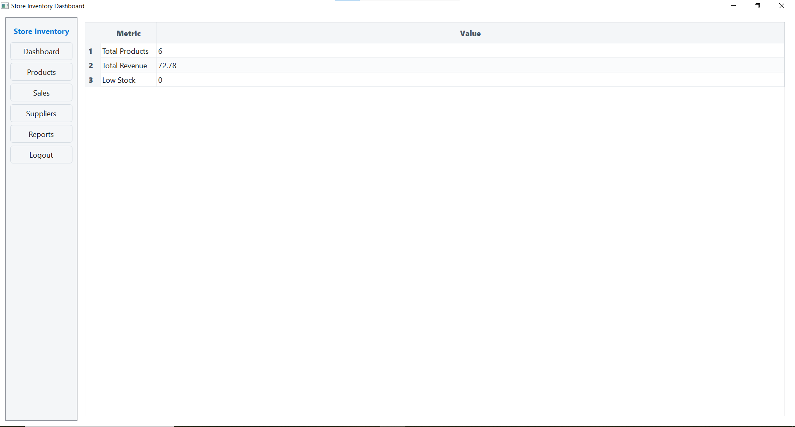
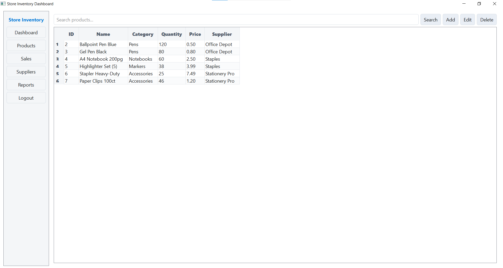
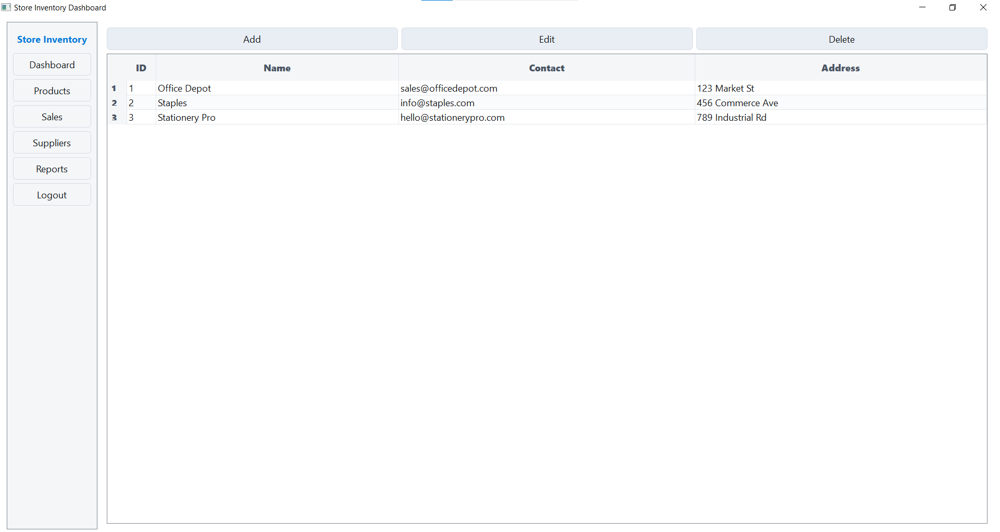
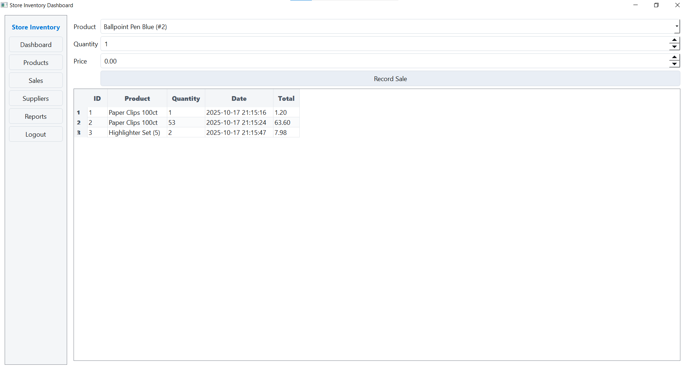

# Store Inventory App – Image Guide

This README documents the UI screenshots stored in `store_inventory/img/`. Each section includes the image preview and an explanation of what the screen shows and how to use it.

## Image Index
- **[Login Page](#login-pagepng)**
- **[Dashboard](#dashboardpng)**
- **[Products](#productspng)**
- **[Suppliers](#supplierspng)**
- **[Sales](#salespng)**
- **[Report](#reportpng)**

---

## Login Page.png
- **Path**: `store_inventory/img/Login Page.png`
- **Size**: ~2.35 MB
- **Purpose**: Authentication gateway to the application.

**Online explanation**
- **Username & Password**: Enter your credentials to access the app. On first run, a default admin user is created: `admin / admin123`.
- **Security**: Passwords are hashed using `bcrypt`. Failed attempts show a warning.
- **Result**: Successful login routes you to the `Dashboard`.

---

## Dashboard.png
- **Path**: `store_inventory/img/Dashboard.png`
- **Size**: ~30.4 KB
- **Purpose**: Overview of system metrics in a sheet-like table.

**Online explanation**
- **Sidebar Navigation**: Buttons to switch between `Dashboard`, `Products`, `Sales`, `Suppliers`, and `Reports`, and to `Logout`.
- **Metrics Table**: Shows `Total Products`, `Total Revenue`, and `Low Stock` in a clean, spreadsheet-like grid.
- **Live Data**: Values update after each CRUD operation or sale.

---

## Products.png
- **Path**: `store_inventory/img/Products.png`
- **Size**: ~45.1 KB
- **Purpose**: Manage the product catalog.

**Online explanation**
- **Search**: Filter by name or category.
- **Grid Columns**: `ID`, `Name`, `Category`, `Quantity`, `Price`, `Supplier`.
- **Actions**: `Add`, `Edit`, `Delete` open simple dialogs for quick edits.
- **Stock**: Quantity updates automatically when recording sales.

---

## suppliers.png
- **Path**: `store_inventory/img/suppliers.png`
- **Size**: ~34.3 KB
- **Purpose**: Maintain supplier records.

**Online explanation**
- **Grid Columns**: `ID`, `Name`, `Contact`, `Address`.
- **Linkage**: Products reference `supplier_id` to establish relationships.
- **Actions**: `Add`, `Edit`, `Delete` supplier info.

---

## Sales.png
- **Path**: `store_inventory/img/Sales.png`
- **Size**: ~38.1 KB
- **Purpose**: Record sales transactions and view history.

**Online explanation**
- **Record Sale**: Choose a product, set `Quantity` and `Price` then click `Record Sale`.
- **Validation**: Prevents sales greater than available stock.
- **Effects**: Inserts a row in `sales` and decrements product `quantity`. Updates `Total Revenue` on Dashboard.
- **Grid Columns**: `ID`, `Product`, `Quantity`, `Date`, `Total`.

---

## Report.png
- **Path**: `store_inventory/img/Report.png`
- **Size**: ~23.7 KB
- **Purpose**: Reporting and PDF export.

**Online explanation**
- **Charts**: Generates top products and monthly sales charts using Matplotlib (rendered on export headless).
- **Export PDF**: Click `Export PDF Report` to save a compiled PDF with embedded charts.
- **Use Cases**: Share performance snapshots with stakeholders.

---

## Tips
- Replace screenshots as the UI evolves; keep filenames consistent for stable references in docs.
- For high-DPI displays, capture images at 125%+ scaling for crisp results.
- If you reorganize images, update the `Path` notes and links above accordingly.
