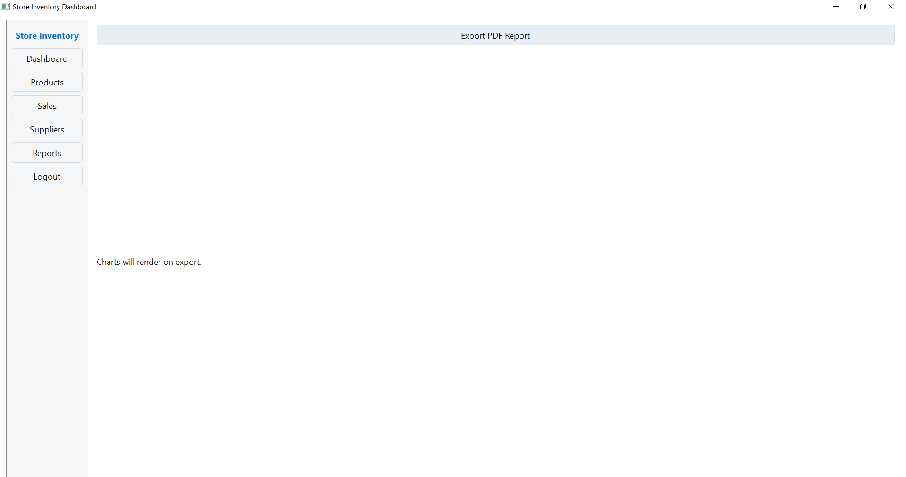

# Store Inventory Management System

A desktop Store Inventory Management System built with Python, PyQt5, and SQLite.

## Features
- Login with hashed passwords (bcrypt)
- Dashboard with quick metrics
- Manage Products (CRUD)
- Manage Suppliers (CRUD)
- Record Sales (updates product stock)
- Reports: basic charts and PDF export

## Tech Stack
- Python 3.x
- PyQt5 (GUI)
- SQLite (database)
- matplotlib (charts)
- reportlab (PDF)
- bcrypt (password hashing)

## Install
```
pip install -r requirements.txt
```

## Run
```
python -m store_inventory.main
```
First run will initialize `store_inventory.db` and create a default admin user:
- username: `admin`
- password: `admin123`

## Package as .exe (Windows)
```
pyinstaller --onefile store_inventory/main.py --name StoreInventoryApp --noconsole
```

## Project Structure
```
store_inventory/
├── main.py
├── ui/
│   ├── login.ui
│   ├── dashboard.ui
│   ├── products.ui
│   ├── sales.ui
│   ├── suppliers.ui
│   └── reports.ui
├── database/
│   ├── db_init.py
│   ├── db_connection.py
│   ├── models.py
├── modules/
│   ├── auth.py
│   ├── product_manager.py
│   ├── sales_manager.py
│   ├── supplier_manager.py
│   └── report_manager.py
├── assets/
│   ├── logo.png (placeholder)
│   └── icons/ (.gitkeep)
└── README.md
```

## Notes
- `assets/logo.png` is a placeholder. Replace with your logo (recommended min 256x256 PNG).
- The app uses `.ui` files loaded at runtime with `uic.loadUi`.
- Database file `store_inventory.db` is created in the package root on first run.

## Screenshots

- **Login Page** – Login screen to authenticate users with secure credentials.


- **Dashboard** – Sheet-like overview table showing Total Products, Total Revenue, and Low Stock.


- **Products** – Manage product catalog with search and CRUD actions.


- **Suppliers** – Maintain supplier records linked to products.


- **Sales** – Record sales transactions and see history.


- **Report** – Generate charts and export a PDF report.



### Example Report PDF

- **Inventory Report (PDF)** – Example exported report with embedded charts.

[Download inventory_report33.pdf](img/inventory_report33.pdf)
